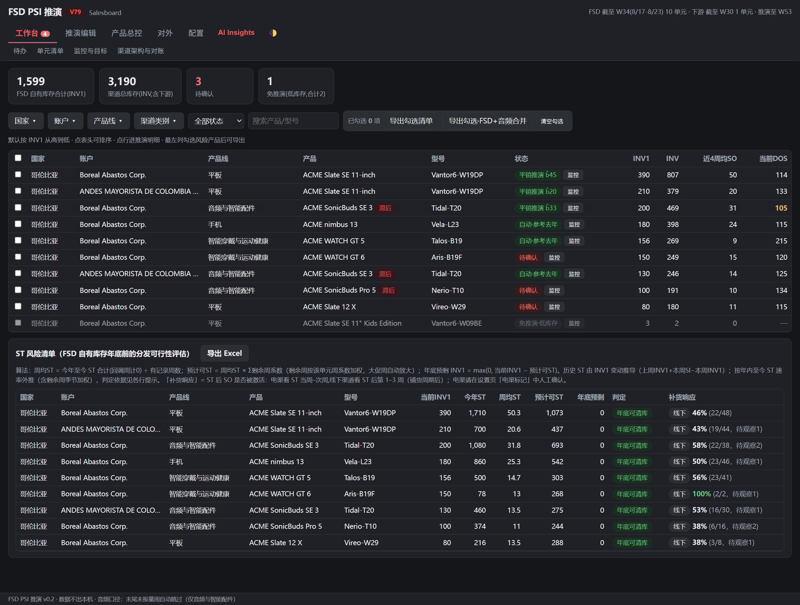
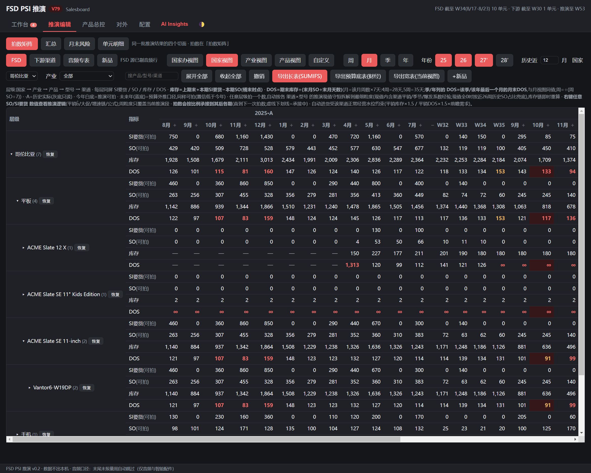
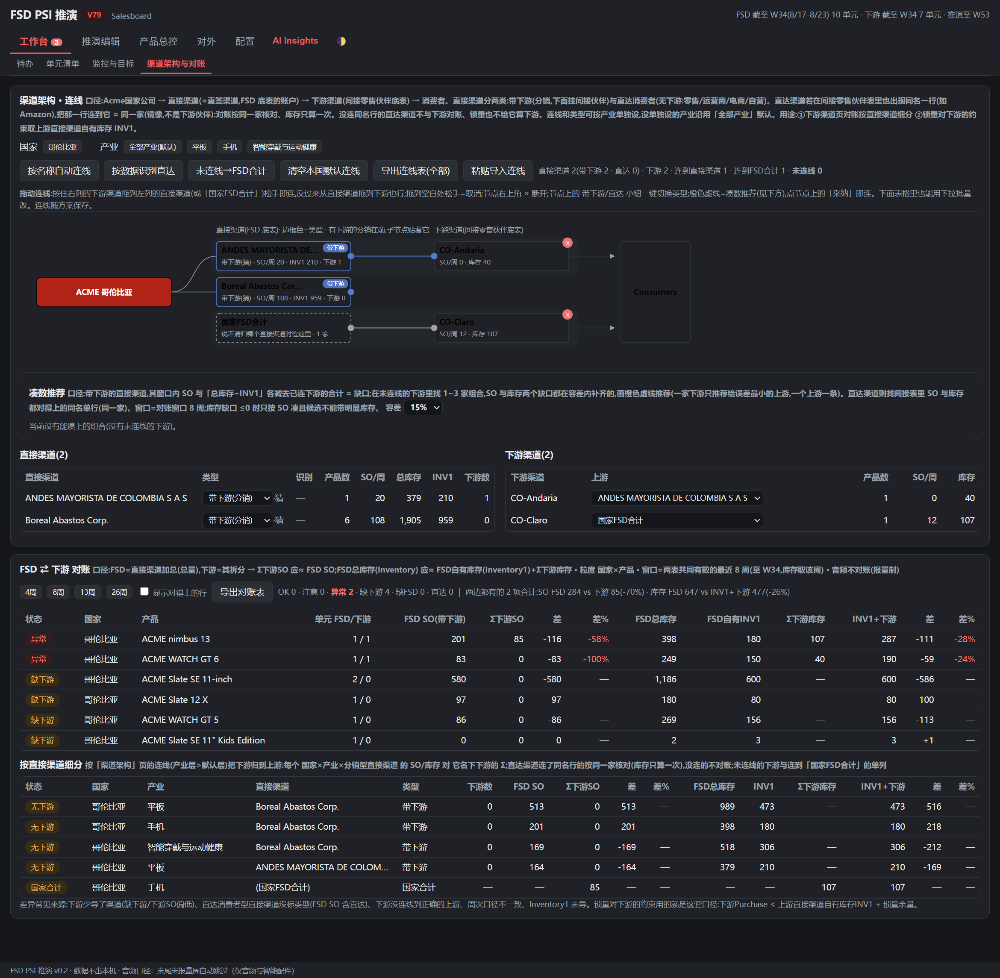
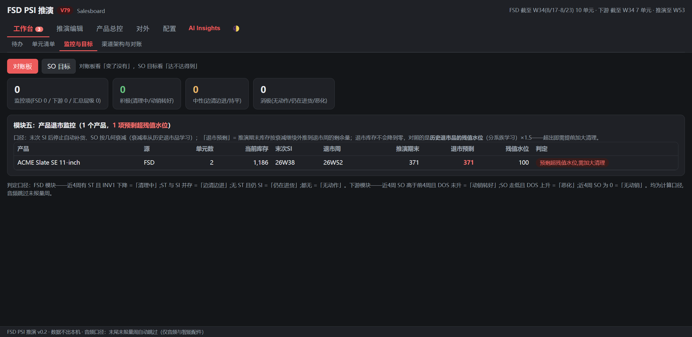

# PSI Simulator

> **Educational use only.** This project is published for learning and demonstration.
> Commercial use is not permitted; anyone considering commercial use is solely
> responsible for legal and regulatory compliance in every applicable jurisdiction.
> See [LICENSE](LICENSE).

**A single-file channel-inventory risk tool: weekly sell-in / sell-out / sell-through simulation with month-end days-of-stock, built for field sales teams.**

Import three weekly source sheets (distributor, downstream channel, audio), and it rolls PSI forward — SO / SI / ST and month-end DOS per unit — then flags where stock-outs or overstock will land before a purchase order is committed. Twelve tabs cover monitoring & reconciliation, layered target setting, and Excel round-trips.

## What's inside

- **Planning engine** — order rounding (MOQ/carton), replenishment triggers, inventory floors, per-channel replenishment cycles; a **baseline engine** that strips launch weeks, promo weeks, stock-out weeks and true decline tails before taking a median with bounded Theil–Sen drift (confidence-graded, with an honest fallback to the recent average).
- **Country SO-target loop** — a fourth data source for country targets, a tracking view (commitment-based scoring: achieved SO and actual vs. promised DOS) and an editable template view that exports live-formula Excel back to countries.
- **Lifecycle** — last sell-in with geometric decay learned from retired products, end-of-sale alerts on residual stock, successor hand-over from new-product plans.
- **Backtests & wiring** — replenishment-pattern backtests (one-shot-then-silent flagged as a warning pattern); a suggestion engine that matches unlinked downstream channels to upstream accounts by SO and inventory gaps.
- **Built-in AI analyst (v29+)** — the same router → domain experts → synthesizer architecture as [Salesboard](https://github.com/lucasopsioi/salesboard), ported here with empty-reply degradation for dual-expert synthesis.
- **600+ self-tests** run against the *same* core block the app executes (`/*CORE-START*/ … /*CORE-END*/` is extracted by regex, so there is zero logic duplication between app and tests).

> Personal project; no employer code or data. Every product, channel and account in the sample data is fictional; `make-fixture.js` generates the demo spreadsheets.

## Run it

```bash
# the app itself: just open FSD-PSI.html in a browser — the whole app is one file, zero install
node test.js                # self-tests, no dependencies needed

npm install                 # only needed for the optional steps below
node make-fixture.js fixtures   # generate demo .xlsx fixtures into ./fixtures to import
npm start                   # or run it as a desktop window (Electron)
```

The tool itself is deliberately dependency-free: the entire simulator (engine + UI) opens from disk with zero install, which is what field teams actually need. Dependencies are only for generating demo spreadsheets and the optional desktop shell.

Prefer a packaged build? Grab the portable **FSD-PSI-Sim.exe** from [Releases](https://github.com/lucasopsioi/psi-simulator/releases/latest) — no install, no dependencies; it opens on the built-in sample dataset so the boards are populated from the first second.

## Screenshots

Every screenshot below was taken on the built-in sample dataset that loads on first start (synthetic units, channels and product names).

| Workbench — unit list with live DOS and year-end sell-through risk | Simulation editor — hand-set any SI/SO at any level, the model re-balances |
|---|---|
|  |  |

| Channel architecture — drag-to-link direct and downstream channels, reconciliation | Monitoring & targets |
|---|---|
|  |  |

## Version history

One build number per shipped version; see [CHANGELOG.md](CHANGELOG.md) for the condensed V10 → V79 evolution (SO-target loop, simulation engine, lock quantities, three audit rounds on hand-set numbers, board consolidation into five views).
